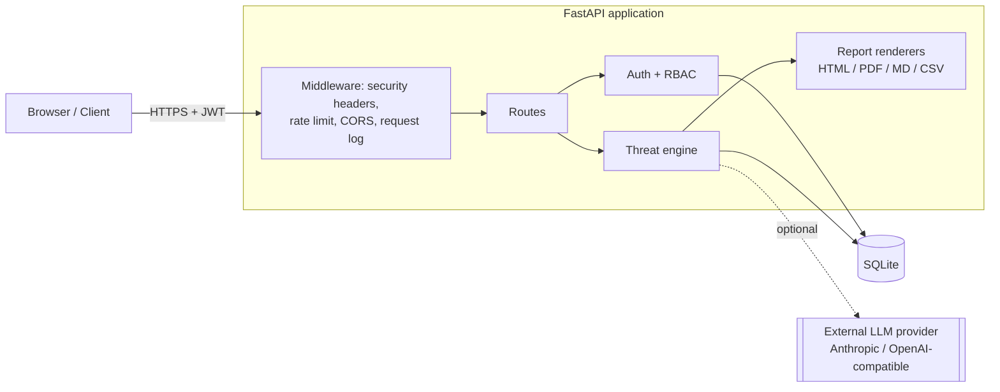
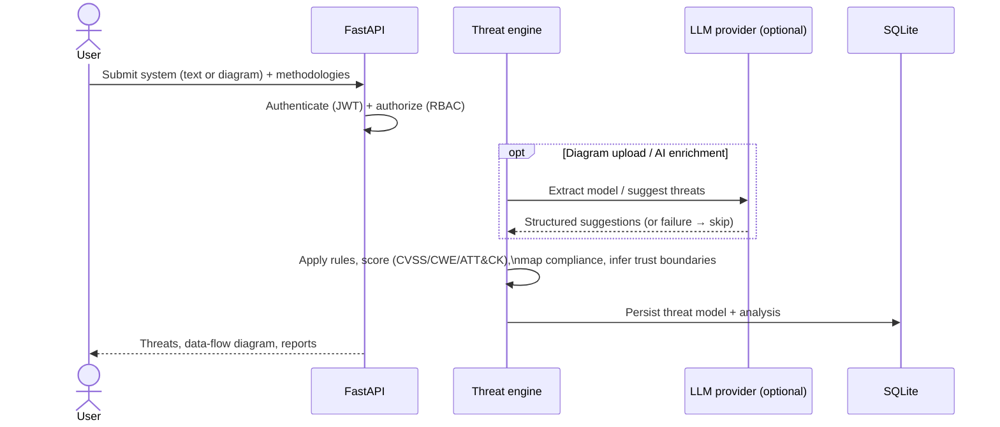
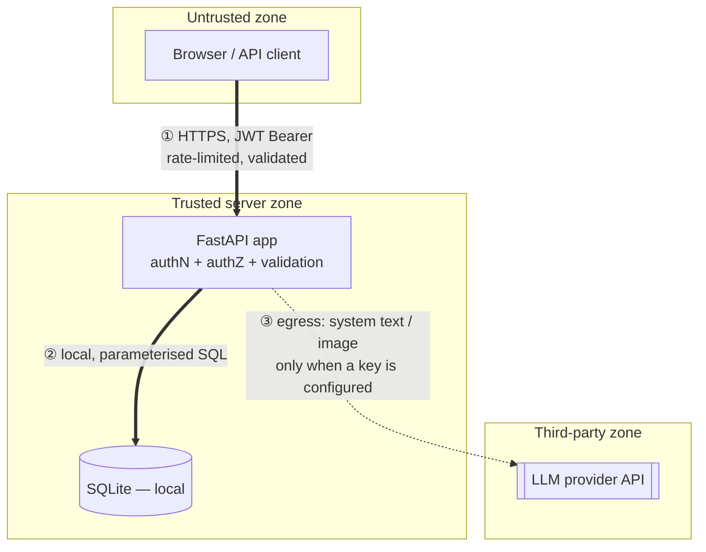
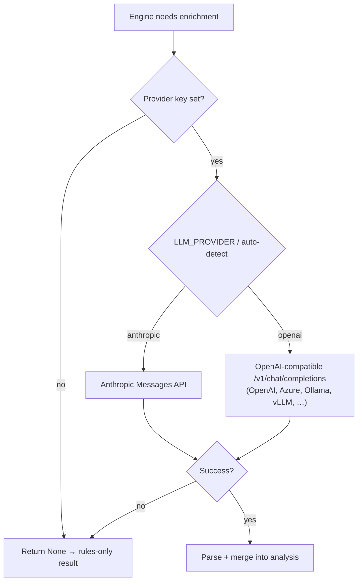

# Architecture

A tour of how ThreatGuard is put together, aimed at a first-time reader —
especially a security engineer evaluating the tool. Diagrams are written in
Mermaid and render inline on GitHub.

## High-level overview

ThreatGuard is a single FastAPI application. A browser talks to it over HTTPS;
the app authenticates the request, runs a deterministic threat-analysis engine
(optionally enriched by an LLM), persists results in SQLite, and renders reports.
The LLM provider is **external and optional** — with no key configured, the app
runs entirely locally on its rule engine.



## Components

| Component | Location | Responsibility |
|-----------|----------|----------------|
| **HTTP app & middleware** | `app.py` | Routes, security headers, per-IP rate limiting, CORS, request logging, static/templates. |
| **Auth & RBAC** | `auth/` | JWT issue/verify with refresh-token rotation, bcrypt hashing, account lockout, a permission registry, and per-resource ownership checks. |
| **Threat engine** | `threat_engine/` | The core. Methodology rules, scoring, mappings, trust-boundary inference, DFD rendering, diagram extraction, the LLM provider layer, and report generation. |
| **Persistence** | `db/` | SQLite schema + parameterised domain queries for the Release → Feature → Threat Model hierarchy. |
| **UI** | `templates/`, `static/` | Server-rendered pages plus the interactive DFD editor. |

Inside the engine, the notable modules are `methodologies.py` (STRIDE / DREAD /
LINDDUN / PASTA / OWASP rules), `analyzer.py` (extraction + rule application +
boundary inference), `scoring.py` (CVSS 3.1/4.0), `detail.py` (CWE, ATT&CK,
mitigations), `trust_boundaries.py`, `dfd.py` (SVG), `diagram_extractor.py`
(image → model), `llm.py` (provider abstraction), and the report renderers
(`html_report.py`, `report.py`, `executive_report.py`).

## Data flow (analyzing a system)



The rule engine always runs; LLM steps are additive and fail safe (see below).

## Technology stack

- **Language/runtime:** Python 3.11+
- **Web:** FastAPI + Uvicorn, Jinja2 templates (autoescaped)
- **Auth:** JWT (PyJWT), bcrypt
- **Persistence:** SQLite
- **Reports:** ReportLab + svglib (PDF), custom HTML/Markdown/CSV
- **LLM (optional):** Anthropic SDK and the OpenAI SDK (used for any
  OpenAI-compatible endpoint)
- **Tests:** in-process FastAPI `TestClient` across 7 suites

## Trust boundaries (of the application itself)

> Not to be confused with the trust boundaries ThreatGuard *infers for systems it
> analyzes*. This is the deployment boundary model of ThreatGuard as software.



- **① Client ↔ server** — the primary boundary. All data endpoints require a
  valid JWT; inputs are validated; responses carry security headers. Auth is
  header-based (not cookies), so classic CSRF does not apply.
- **② Server ↔ database** — local SQLite over parameterised queries; no
  untrusted network in between.
- **③ Server ↔ LLM provider** — a **data-egress** boundary. Crossed **only** when
  a provider key is configured; the system description (and uploaded image, for
  diagram extraction) is sent to that third party. With no key, this boundary
  does not exist.

## LLM interaction flow

The provider layer (`threat_engine/llm.py`) is a thin, fail-safe abstraction. It
never raises into the request path — on any error it returns `None` and the
deterministic engine carries on.



Security implication: model output is treated as **untrusted input** — it is
escaped on render and never executed. Model *quality* is the operator's choice;
the engine's correctness does not depend on it.

## Repository structure

```
Automated-Threat-Modelling/
├── README.md, LICENSE, CHANGELOG.md, ROADMAP.md …   # project meta + governance
├── docs/                # audit records, sample report, screenshots, images
├── examples/            # sample inputs and reports
└── threat-modeler/      # the application
    ├── app.py
    ├── auth/  db/  threat_engine/
    ├── templates/  static/
    └── tests/
```

For contributor setup and conventions, see [CONTRIBUTING.md](CONTRIBUTING.md); for
limitations, [KNOWN_LIMITATIONS.md](KNOWN_LIMITATIONS.md).
