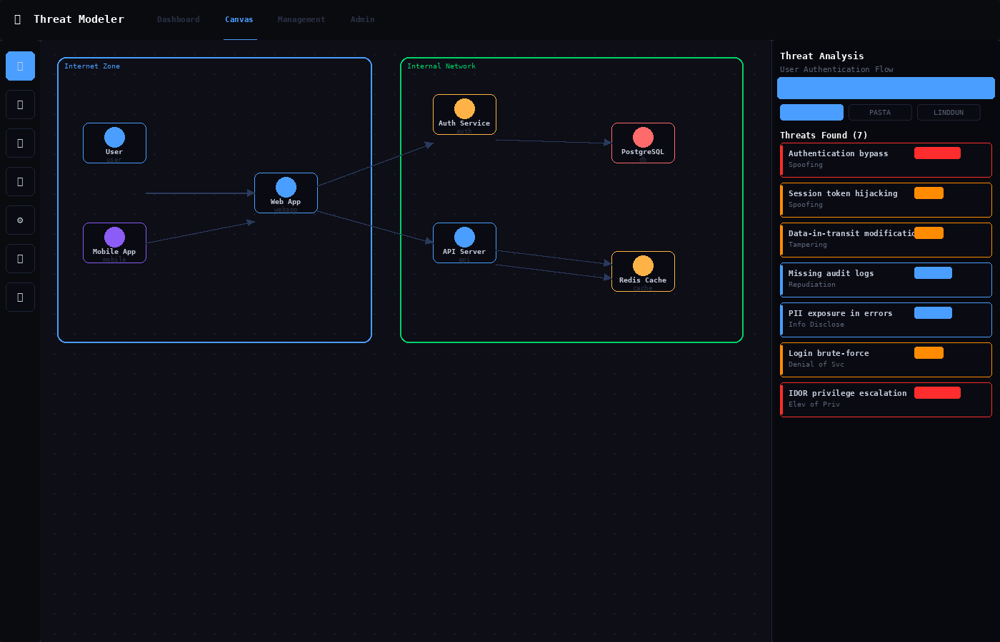
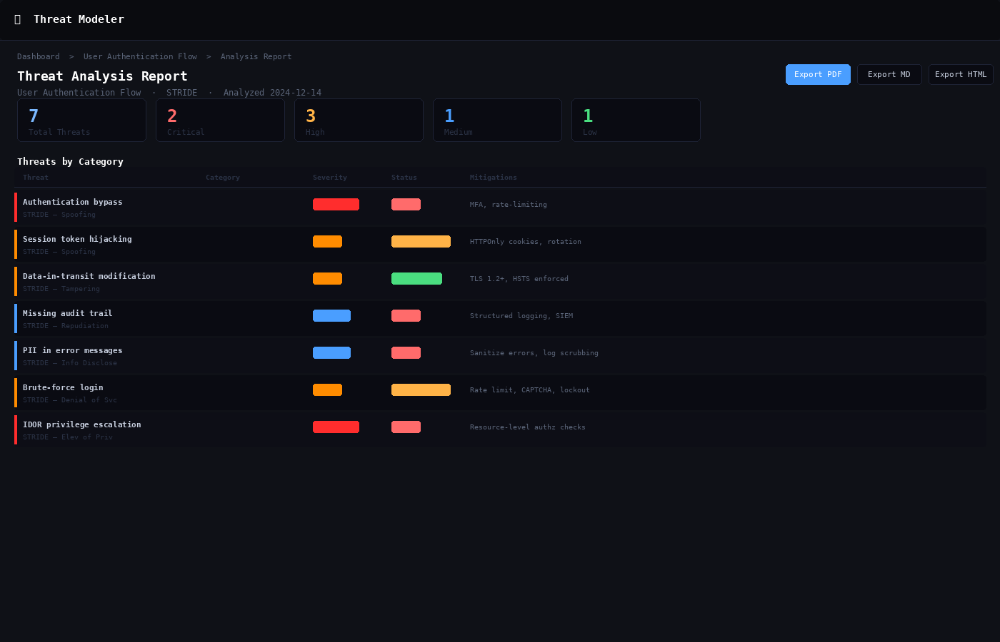

<div align="center">

# 🛡️ Automated Threat Modelling

**AI-powered threat modeling platform with STRIDE, PASTA & LINDDUN methodologies**

[](https://python.org)
[](https://fastapi.tiangolo.com)
[](https://docker.com)
[](https://azure.com)
[](LICENSE)

*Draw your system architecture → get a full threat model in seconds*

</div>

---

## Screenshots

### Dashboard — Threat Model Overview


### DFD Canvas — Drag-and-Drop Architecture Editor


### Threat Analysis Report — STRIDE Results with Export


---

## What is this?

Automated Threat Modelling is an open-source web application that takes your system architecture — described either as a diagram or in plain text — and automatically generates a comprehensive threat model using industry-standard methodologies.

**Key capabilities:**

- 🎨 **Visual DFD canvas** — drag-and-drop data flow diagram editor with auto-layout
- 📝 **Text-to-diagram** — describe your system in plain English, the engine extracts components automatically
- 🔍 **Multi-methodology analysis** — STRIDE, PASTA, LINDDUN applied simultaneously
- 🤖 **AI enhancement** — optional Claude AI enrichment for deeper threat reasoning
- 🏢 **Full RBAC** — three-tier role system (Admin / Management / User)
- 📊 **Reports** — export as Markdown, HTML, or PDF
- 🔐 **JWT auth** — access tokens + refresh tokens with full audit log
- 🐳 **Docker ready** — single command to run
- ☁️ **Azure deployable** — Bicep templates + GitHub Actions included

---

## How it works

```
Your system description
        │
        ▼
┌───────────────────┐     ┌─────────────────────────┐
│   DFD Editor      │ ──► │   Threat Engine          │
│  (drag & drop)    │     │                          │
│                   │     │  ┌─────────────────────┐ │
│  OR               │     │  │ STRIDE analysis     │ │
│                   │     │  │ PASTA analysis      │ │
│  Text description │     │  │ LINDDUN analysis    │ │
│  (auto-extracted) │     │  └─────────────────────┘ │
└───────────────────┘     │                          │
                          │  + Claude AI (optional)  │
                          └──────────┬───────────────┘
                                     │
                          ┌──────────▼───────────────┐
                          │  Threat Report            │
                          │  • Threats by category   │
                          │  • Severity scoring      │
                          │  • Mitigations           │
                          │  • Trust boundary map    │
                          │  • Export MD/HTML/PDF    │
                          └──────────────────────────┘
```

---

## User Roles

| Role | What they can do |
|------|-----------------|
| **Admin** | Full access — manage users, releases, features, all threat models, audit log |
| **Management** | Read-only overview of all features and threat summaries |
| **User** | Create and manage their own threat models for assigned features |

---

## Prerequisites

| Tool | Version | Required for |
|------|---------|-------------|
| Python | 3.11+ | Local run |
| pip | Any | Local run |
| Docker | 20+ | Docker run |
| Docker Compose | v2 | Docker run |
| Azure CLI | Any | Azure deploy |

---

## Option 1 — Run Locally (Python)

### Step 1 — Extract the project

```bash
# Download threat-modeler.zip from the repo, then:
unzip threat-modeler.zip
cd threat-modeler
```

### Step 2 — Create a virtual environment

```bash
python3 -m venv venv
source venv/bin/activate          # macOS / Linux
# OR
venv\Scripts\activate             # Windows
```

### Step 3 — Install dependencies

```bash
pip install -r requirements.txt
```

### Step 4 — Set environment variables

**Required:**
```bash
export INITIAL_ADMIN_EMAIL=admin@yourcompany.com
export INITIAL_ADMIN_PASSWORD=changeme123
export JWT_SECRET=$(python3 -c "import secrets; print(secrets.token_urlsafe(48))")
```

**Optional — enables Claude AI enrichment:**
```bash
export ANTHROPIC_API_KEY=sk-ant-xxxxxxxxxxxx
```

> **Windows:** use `set` instead of `export`

### Step 5 — Run

```bash
python app.py
```

### Step 6 — Open

```
http://127.0.0.1:8000
```

Log in with your `INITIAL_ADMIN_EMAIL` and `INITIAL_ADMIN_PASSWORD`.

---

## Option 2 — Run with Docker (recommended)

### Step 1 — Extract

```bash
unzip threat-modeler.zip && cd threat-modeler
```

### Step 2 — Create `.env`

```bash
cat > .env << EOF
INITIAL_ADMIN_EMAIL=admin@yourcompany.com
INITIAL_ADMIN_PASSWORD=ChangeMe123!
JWT_SECRET=$(python3 -c "import secrets; print(secrets.token_urlsafe(48))")
ANTHROPIC_API_KEY=sk-ant-xxxx
EOF
```

### Step 3 — Start

```bash
docker compose up -d
```

### Step 4 — Open

```
http://localhost:8000
```

**Useful Docker commands:**
```bash
docker compose logs -f              # live logs
docker compose down                 # stop
docker compose up -d --build        # rebuild after changes
```

> Data persists in `./data/` — SQLite survives container restarts.

---

## Option 3 — Deploy to Azure

```bash
export ANTHROPIC_API_KEY="sk-ant-..."
export LOCATION="eastus"
export RG="threat-modeler-rg"

chmod +x deploy/azure/deploy.sh
./deploy/azure/deploy.sh
```

Takes 5–8 minutes. Prints your HTTPS URL at the end.

**Cost: ~$18/month** (App Service B1 ~$13 + ACR Basic ~$5)

See [`deploy/azure/README.md`](deploy/azure/README.md) for full details including Bicep templates, GitHub Actions CI/CD, and custom domain setup.

---

## First Run Walkthrough

### 1. Log in as Admin
Go to `http://localhost:8000`, log in with your admin credentials.

### 2. Create a Release
**Admin → Releases → Create**
```
Name: v2.0
Status: in_progress
```

### 3. Create a Feature
**Admin → Features → Create**
```
Release: v2.0
Name: User Authentication Flow
```

### 4. Create a Threat Model
Go to **Dashboard → New Threat Model**

**Option A — Draw it:** Drag components (User, API, Database, Auth Service) onto the canvas, connect with arrows, click **Analyze**

**Option B — Describe it:**
```
Our system has a React web app that talks to a FastAPI backend.
The backend authenticates users via JWT and stores data in PostgreSQL.
A Redis cache sits in front of the database. Admins access an admin panel.
```
Click **Extract Components** → review diagram → **Analyze**

### 5. Review threats
Threats organized by category, severity (Critical/High/Medium/Low), with specific mitigations.

### 6. Track status
For each threat set: `open` → `in_progress` → `mitigated` → `accepted_risk`

### 7. Export
Click **Export** → **Markdown**, **HTML**, or **PDF**

---

## Environment Variables

| Variable | Required | Description |
|----------|----------|-------------|
| `INITIAL_ADMIN_EMAIL` | ✅ Yes | Admin account email (created on first run) |
| `INITIAL_ADMIN_PASSWORD` | ✅ Yes | Admin password (min 8 chars) |
| `JWT_SECRET` | ✅ Yes | Random 48-char string for signing tokens |
| `ANTHROPIC_API_KEY` | Optional | Enables Claude AI enrichment — [console.anthropic.com](https://console.anthropic.com) |
| `HOST` | Optional | Bind address (default: `127.0.0.1`) |
| `PORT` | Optional | Port number (default: `8000`) |
| `CORS_ORIGINS` | Optional | Comma-separated allowed origins (default: `*`) |

---

## Threat Methodologies

### STRIDE

| Letter | Threat | Example |
|--------|--------|---------|
| **S** | Spoofing | Impersonating a user via stolen credentials |
| **T** | Tampering | SQL injection modifying database records |
| **R** | Repudiation | Denying actions due to missing audit logs |
| **I** | Information Disclosure | PII exposed via verbose error messages |
| **D** | Denial of Service | Flooding the API to block legitimate access |
| **E** | Elevation of Privilege | IDOR accessing other users' data |

### PASTA
Process for Attack Simulation and Threat Analysis — risk-centric, attacker-focused.

### LINDDUN
Privacy threat modeling: Linkability, Identifiability, Non-repudiation, Detectability, Disclosure, Unawareness, Non-compliance.

---

## API Reference

All endpoints require `Authorization: Bearer <access_token>` except auth endpoints.

| Method | Endpoint | Description |
|--------|----------|-------------|
| `POST` | `/api/auth/register` | Self-register (User role) |
| `POST` | `/api/auth/login` | Login → access + refresh tokens |
| `POST` | `/api/auth/refresh` | Refresh access token |
| `POST` | `/api/threat-models` | Create threat model |
| `POST` | `/api/threat-models/{id}/analyze` | Run analysis |
| `GET` | `/api/threat-models/{id}/report/{fmt}` | Export (markdown/html/pdf) |
| `PUT` | `/api/threat-models/{id}/threats/{tid}/status` | Update threat status |
| `POST` | `/api/extract-from-text` | Extract components from plain text |
| `GET` | `/api/audit-log` | Full audit log (admin only) |
| `GET` | `/api/health` | Health check |

Full interactive docs at `http://localhost:8000/docs` (Swagger UI).

---

## Project Structure

```
threat-modeler/
├── app.py                      # FastAPI app — all routes
├── requirements.txt
├── Dockerfile
├── docker-compose.yml
├── auth/                       # JWT auth + RBAC
├── db/                         # SQLite layer
├── threat_engine/              # STRIDE/PASTA/LINDDUN engine
│   ├── analyzer.py             # Text extraction + rules
│   ├── methodologies.py        # Threat catalogs
│   ├── dfd.py                  # DFD SVG renderer
│   └── report.py               # MD/HTML/PDF export
├── static/js/                  # Frontend JS
├── templates/                  # Jinja2 HTML
├── tests/                      # pytest suite
├── docs/screenshots/           # App screenshots
└── deploy/azure/               # Bicep + deploy scripts
```

---

## Running Tests

```bash
source venv/bin/activate
python -m pytest tests/ -v
# or quick smoke test:
chmod +x tests/smoke_test.sh && ./tests/smoke_test.sh
```

---

## Troubleshooting

| Problem | Fix |
|---------|-----|
| `ModuleNotFoundError` | Run `pip install -r requirements.txt` with venv active |
| `JWT_SECRET not set` | `export JWT_SECRET=$(python3 -c "import secrets; print(secrets.token_urlsafe(48))")` |
| Port 8000 in use | `export PORT=8080` then restart |
| Admin account missing | Set `INITIAL_ADMIN_EMAIL` + `INITIAL_ADMIN_PASSWORD` before first run |
| PDF export fails | `apt-get install libpango-1.0-0 libpangoft2-1.0-0` (Linux) |
| Azure 502 on deploy | Normal — wait 2 min for container cold start |
| LLM not working | Check `ANTHROPIC_API_KEY` is set; confirm via `/api/health` |

---

## Claude AI Enhancement (Optional)

When `ANTHROPIC_API_KEY` is set, the engine upgrades from heuristic to AI-powered analysis — deeper threat reasoning, smarter trust boundary inference, richer mitigations tailored to your specific stack.

Get an API key at **https://console.anthropic.com**

```bash
# Local
export ANTHROPIC_API_KEY=sk-ant-xxxx && python app.py

# Docker
echo "ANTHROPIC_API_KEY=sk-ant-xxxx" >> .env && docker compose up -d

# Azure
az webapp config appsettings set -n <app-name> -g <rg> \
  --settings ANTHROPIC_API_KEY="sk-ant-xxxx"
```

---

## Contributing

PRs welcome! Key areas:
- Additional methodology support (DREAD, MITRE ATT&CK)
- PostgreSQL backend option
- Slack/Teams/Jira integration
- Expanded test coverage

---

## License

MIT License — free for personal and commercial use.

---

## Security Notes

- Change `INITIAL_ADMIN_PASSWORD` immediately after first login
- Generate a unique `JWT_SECRET` per environment
- Never commit `.env` files
- All state changes recorded in the audit log (`/api/audit-log`)

---

<div align="center">

Built with FastAPI · SQLite · Claude AI · Azure

**[⬆ Back to top](#)**

</div>
