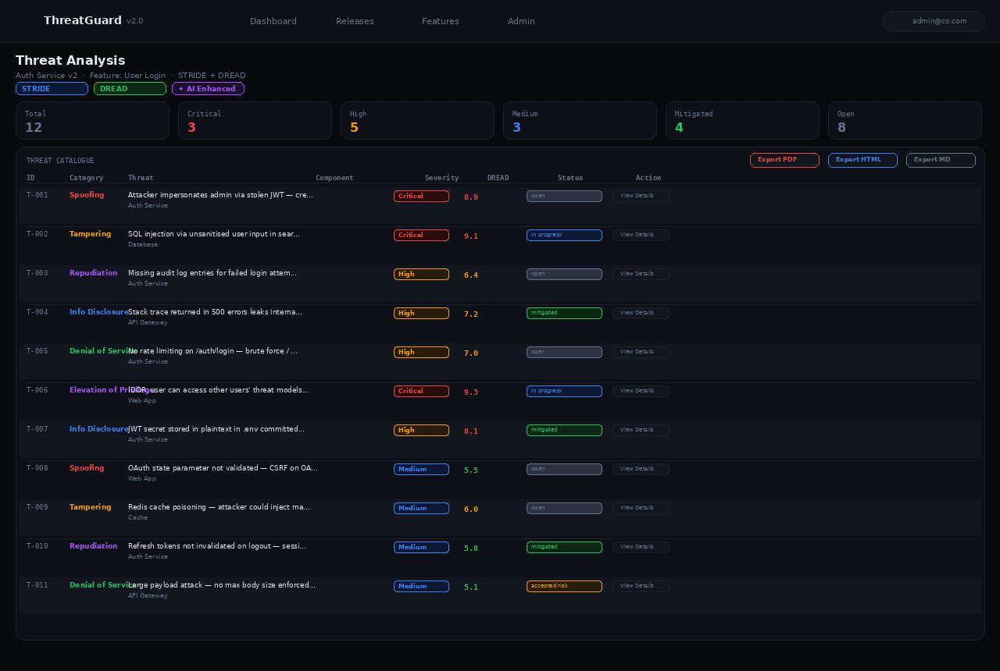

<div align="center">

# 🛡️ Automated Threat Modelling — ThreatGuard

**AI-powered threat modeling platform**

[](https://python.org)
[](https://fastapi.tiangolo.com)
[](https://docker.com)
[](https://azure.com)
[](https://anthropic.com)
[](LICENSE)

*Describe your system in plain English → get a full STRIDE / DREAD / PASTA / LINDDUN threat model in seconds*

</div>

---

## 📸 Screenshots

<table>
<tr>
<td align="center" width="50%"><b>Dashboard — All Threat Models</b></td>
<td align="center" width="50%"><b>New Threat Model — Describe & Analyze</b></td>
</tr>
<tr>
<td></td>
<td></td>
</tr>
</table>

<p align="center">
  <b>Threat Analysis — Full Catalogue with DREAD Scoring & Status Tracking</b><br/>
  
</p>

---

## ✨ Features

| Feature | Details |
|---------|---------|
| 📝 **Text-to-Threat-Model** | Describe your system in plain English — engine auto-extracts components, data flows, trust boundaries |
| 🔍 **Multi-Methodology** | STRIDE, DREAD, PASTA, LINDDUN — run simultaneously |
| 🤖 **Claude AI Enhancement** | Optional — context-specific threats, smarter trust boundaries, richer mitigations |
| 🏢 **Full RBAC** | Admin / Management / User roles with feature-level access control |
| 📊 **DFD Auto-Generator** | SVG data flow diagrams with Internet / DMZ / App / Data trust zones |
| 📄 **Export Reports** | PDF, HTML, or Markdown |
| 🔐 **JWT Auth** | Access + refresh tokens, full audit log |
| 🐳 **Docker Ready** | One command to run — `docker compose up` |
| ☁️ **Azure Deployable** | Bicep templates + GitHub Actions CI/CD included |
| 🧬 **Test Suite** | pytest + shell smoke tests |

---

## 🚀 Quick Start

### Option A — Docker (Fastest, Recommended)

```bash
# 1. Clone and extract
git clone https://github.com/rootabhi1/Automated-Threat-Modelling.git
cd Automated-Threat-Modelling
unzip threat-modeler.zip && cd threat-modeler

# 2. Configure environment
cp .env.example .env
# Edit .env: set INITIAL_ADMIN_EMAIL, INITIAL_ADMIN_PASSWORD, JWT_SECRET

# 3. Run
docker compose up --build

# 4. Open http://localhost:8000
```

### Option B — Python (Local Development)

```bash
git clone https://github.com/rootabhi1/Automated-Threat-Modelling.git
cd Automated-Threat-Modelling
unzip threat-modeler.zip && cd threat-modeler

python3 -m venv venv && source venv/bin/activate
pip install -r requirements.txt

export INITIAL_ADMIN_EMAIL=admin@example.com
export INITIAL_ADMIN_PASSWORD=ChangeMe123!
export JWT_SECRET=$(python3 -c "import secrets; print(secrets.token_urlsafe(48))")

python app.py
# → http://127.0.0.1:8000
```

### Option C — Quick Script

```bash
chmod +x run.sh && ./run.sh
```

> 📋 **Full step-by-step guide with screenshots, API examples, test suite, and troubleshooting → [TESTING.md](TESTING.md)**

---

## 🏗️ How It Works

```
Plain-text system description
           │
           ▼
  ┌─────────────────┐     ┌──────────────────────────────────┐
  │  Text Extractor  │────►│         Threat Engine             │
  │  (auto-detects   │     │  ┌────────────────────────────┐  │
  │   components,    │     │  │  STRIDE · DREAD            │  │
  │   data flows,    │     │  │  PASTA  · LINDDUN          │  │
  │   trust zones)   │     │  └────────────────────────────┘  │
  └─────────────────┘     │  + Claude AI (optional)           │
                          └──────────────┬───────────────────┘
                                         │
                          ┌──────────────▼───────────────────┐
                          │         Threat Report             │
                          │  • Threats by category            │
                          │  • DREAD severity scoring         │
                          │  • Concrete mitigations           │
                          │  • Trust boundary map (SVG DFD)   │
                          │  • Per-threat status tracking     │
                          │  • Export: PDF / HTML / Markdown  │
                          └──────────────────────────────────┘
```

---

## 👥 User Roles (RBAC)

| Role | Access |
|------|--------|
| **Admin** | Full access — manage users, releases, features, all threat models, audit log |
| **Management** | Read-only overview of all threat summaries and feature status |
| **User** | Create and manage own threat models for assigned features only |

---

## ⚙️ Environment Variables

| Variable | Required | Default | Description |
|----------|----------|---------|-------------|
| `INITIAL_ADMIN_EMAIL` | ✅ | — | Admin account email (created on first run) |
| `INITIAL_ADMIN_PASSWORD` | ✅ | — | Admin password (min 8 chars) |
| `JWT_SECRET` | ✅ | — | Random 48-char string for signing tokens |
| `ANTHROPIC_API_KEY` | Optional | — | Enables Claude AI enrichment |
| `HOST` | Optional | `127.0.0.1` | Bind address (`0.0.0.0` for Docker) |
| `PORT` | Optional | `8000` | Server port |
| `CORS_ORIGINS` | Optional | `*` | Allowed origins (restrict in production) |

---

## 🔌 API Reference

Interactive Swagger docs at **http://localhost:8000/docs**

| Method | Endpoint | Auth | Description |
|--------|----------|------|-------------|
| `POST` | `/api/auth/login` | — | Login → access + refresh tokens |
| `POST` | `/api/auth/register` | — | Self-register (User role) |
| `POST` | `/api/threat-models` | ✅ | Create a threat model |
| `POST` | `/api/threat-models/{id}/analyze` | ✅ | Run full analysis |
| `GET` | `/api/threat-models/{id}/report/{fmt}` | ✅ | Export PDF / HTML / MD |
| `PUT` | `/api/threat-models/{id}/threats/{tid}/status` | ✅ | Update threat status |
| `POST` | `/api/extract-from-text` | — | Extract components from plain text |
| `GET` | `/api/audit-log` | Admin | Full audit log |
| `GET` | `/api/health` | — | Health check + LLM availability |

---

## 🧬 Running Tests

```bash
source venv/bin/activate
python -m pytest tests/ -v

# Smoke test (needs running server)
chmod +x tests/smoke_test.sh && ./tests/smoke_test.sh
```

---

## ☁️ Deploy to Azure

```bash
export ANTHROPIC_API_KEY="sk-ant-..."
export LOCATION="eastus"
export RG="threat-modeler-rg"
chmod +x deploy/azure/deploy.sh && ./deploy/azure/deploy.sh
# Deploys in 5–8 min. Prints your HTTPS URL.
# Cost: ~$18/month (App Service B1 + ACR Basic)
```

---

## 🧠 Threat Methodologies

### STRIDE
| Letter | Threat | Example |
|--------|--------|---------|
| **S** | Spoofing | Impersonating a user via stolen JWT |
| **T** | Tampering | SQL injection modifying database records |
| **R** | Repudiation | Denying actions due to missing audit logs |
| **I** | Info Disclosure | PII exposed in verbose error messages |
| **D** | Denial of Service | Flooding the login endpoint |
| **E** | Elevation of Privilege | IDOR accessing other users' data |

### DREAD — Risk Scoring
Damage + Reproducibility + Exploitability + Affected users + Discoverability (0–10 scale)

### PASTA
Process for Attack Simulation and Threat Analysis — risk-centric, attacker-focused

### LINDDUN
Privacy threat modeling: Linkability, Identifiability, Non-repudiation, Detectability, Disclosure, Unawareness, Non-compliance

---

## 📁 Project Structure

```
threat-modeler/
├── app.py                 # FastAPI application — all routes
├── requirements.txt       # Python dependencies
├── Dockerfile             # Container image (python:3.12-slim)
├── docker-compose.yml     # One-command deployment
├── .env.example           # Environment variable template
├── TESTING.md             # 📋 Full testing guide (505 lines)
├── auth/                  # JWT auth + RBAC
├── db/                    # SQLite CRUD layer
├── threat_engine/         # STRIDE/DREAD/PASTA/LINDDUN + Claude AI
├── static/                # CSS + Vanilla JS frontend
├── templates/             # Jinja2 HTML templates
├── tests/                 # pytest + shell smoke tests
└── deploy/azure/          # Bicep + GitHub Actions CI/CD
```

---

## 🔒 Security Notes

- Change `INITIAL_ADMIN_PASSWORD` immediately after first login
- Generate a unique `JWT_SECRET` per environment
- Never commit `.env` to git (already in `.gitignore`)
- Restrict `CORS_ORIGINS` in production
- All state changes recorded in audit log at `/api/audit-log`

---

## 📜 License

MIT — free for personal and commercial use.

---

<div align="center">

Built with FastAPI · SQLite · Claude AI · Azure · Python 3.12

**[⬆ Back to top](#)**

</div>
