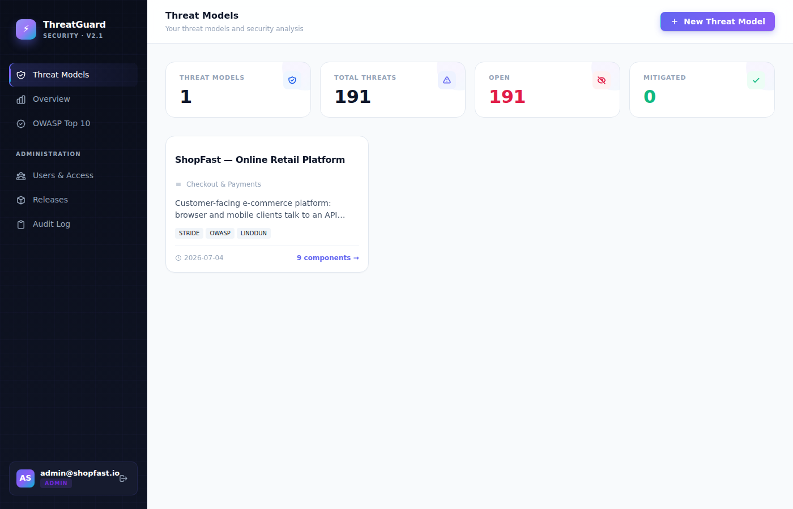
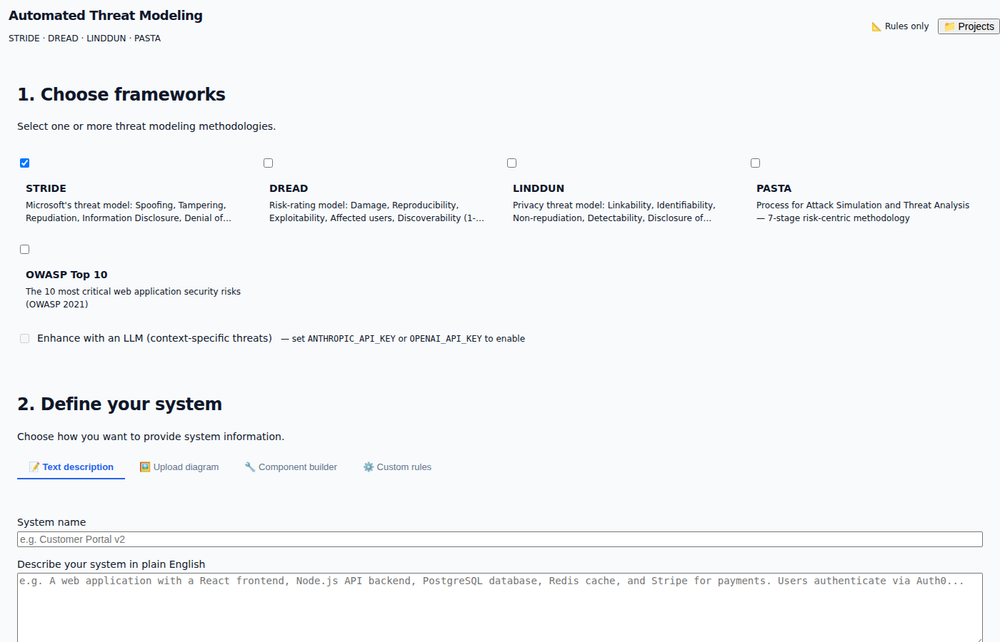
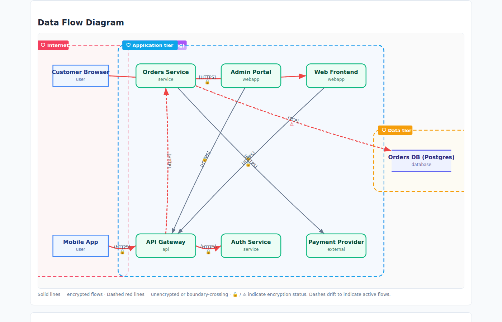

# 🛡 ThreatGuard — Automated Threat Modeling

> Threat modeling for engineering teams — STRIDE, DREAD, LINDDUN, PASTA and OWASP Top 10, with CVSS/CWE/MITRE ATT&CK scoring and compliance mapping. Works fully offline; optionally enriched by an LLM (Claude **or** any OpenAI-compatible model).

[](https://rootabhi1.github.io/Automated-Threat-Modelling/)
[](https://python.org)
[](https://fastapi.tiangolo.com)
[](LICENSE)

---

## What it does

ThreatGuard turns a description of a system — typed, drawn on a canvas, or **uploaded as an architecture diagram** — into a structured threat model: identified threats, severity and CVSS scores, CWE and MITRE ATT&CK references, mapped compliance controls, a data-flow diagram with trust boundaries, and exportable reports.

- **Five methodologies** — STRIDE, DREAD, LINDDUN, PASTA, OWASP Top 10, applied by a deterministic rule engine (no API key required).
- **Rich scoring** — CVSS 3.1 & 4.0, CWE, MITRE ATT&CK technique/tactic, and SOC 2 / ISO 27001 / PCI-DSS control mapping.
- **Trust boundaries & DFD** — boundaries are auto-inferred when none are defined, cross-boundary flows are flagged, and a labelled data-flow diagram is rendered.
- **Diagram upload** — drop in a PNG/JPEG/WebP architecture diagram; with a vision-capable LLM it is turned into a system model, otherwise you get an editable starting point.
- **Optional LLM enrichment** — AI fix generation, diagram extraction and richer narratives via **Claude** or any **OpenAI-compatible** endpoint (OpenAI, Azure, Ollama, vLLM, …). Absent a key, everything still works in rules-only mode.
- **Team workflow** — Release → Feature → Threat Model hierarchy, role-based access (user / management / admin), per-threat status tracking, release-to-release diffs, read-only share links, custom rules, and an audit log.
- **Reports** — HTML, PDF, Markdown, a CSV risk register, and an executive summary.

---

## Sample output

A full generated report is checked in at **[`docs/sample-report.html`](docs/sample-report.html)** — 191 threats across STRIDE / OWASP / LINDDUN for a sample retail platform, each with CVSS, CWE and MITRE ATT&CK references and compliance mapping, plus a data-flow diagram with automatically inferred trust boundaries.

| Dashboard | Threat canvas | Analysis & data-flow diagram |
|---|---|---|
|  |  |  |

---

## Run locally

```bash
# 1. Clone
git clone https://github.com/rootabhi1/Automated-Threat-Modelling
cd Automated-Threat-Modelling/threat-modeler

# 2. Virtual environment + dependencies
python3 -m venv .venv
source .venv/bin/activate          # Windows: .venv\Scripts\activate
pip install -r requirements.txt

# 3. Required environment (see ../.env.example for the full list)
export INITIAL_ADMIN_EMAIL=admin@example.com
export INITIAL_ADMIN_PASSWORD='ChangeMe123!'
export JWT_SECRET=$(python3 -c "import secrets; print(secrets.token_urlsafe(48))")

# 4. (Optional) enable an LLM — pick ONE, or skip for rules-only mode
export ANTHROPIC_API_KEY=sk-ant-...            # Claude
# — or any OpenAI-compatible endpoint —
# export OPENAI_API_KEY=...  OPENAI_MODEL=gpt-4o  OPENAI_BASE_URL=https://api.openai.com/v1

# 5. Start
python app.py                                   # http://localhost:8000
# auto-reload:  uvicorn app:app --reload --port 8000
```

Interactive API docs are served at `/docs`.

### Docker

```bash
cp .env.example .env      # then edit .env (JWT_SECRET + admin creds are required)
docker compose up --build # serves on http://localhost:8000
```

The compose file fails fast if `JWT_SECRET`, `INITIAL_ADMIN_EMAIL` or `INITIAL_ADMIN_PASSWORD` are unset, so containers never boot with insecure defaults.

---

## Configuration

All settings are environment variables; see [`.env.example`](.env.example). The essentials:

| Variable | Required | Purpose |
|---|---|---|
| `JWT_SECRET` | ✅ | Signs access/refresh tokens. Use a long random string. |
| `INITIAL_ADMIN_EMAIL` / `INITIAL_ADMIN_PASSWORD` | ✅ | Admin account seeded on first run. |
| `LLM_PROVIDER` | — | `anthropic` or `openai`; auto-detected from whichever key is set. |
| `ANTHROPIC_API_KEY` / `ANTHROPIC_MODEL` | — | Enable Claude enrichment. |
| `OPENAI_API_KEY` / `OPENAI_MODEL` / `OPENAI_BASE_URL` | — | Enable any OpenAI-compatible model (incl. self-hosted). |
| `CORS_ORIGINS` | — | Restrict origins in production (default `*`). |
| `RATE_LIMIT_ENABLED` | — | Per-IP login/refresh rate limiting (default on). |

No LLM key configured ⇒ the app runs in **rules-only** mode with the full methodology engine.

---

## Security

- JWT auth with refresh-token **rotation** (reuse of a rotated token is rejected) and logout revocation.
- Passwords hashed with bcrypt; failed-login **account lockout**; per-IP rate limiting.
- **Secure by default** — every data endpoint requires a session; role permissions and per-resource ownership are enforced (a user cannot read another user's models).
- Security headers (`X-Frame-Options`, `X-Content-Type-Options`, `Referrer-Policy`, HSTS on HTTPS); reports are XSS-safe (user-supplied names are escaped, including inside embedded JSON).
- Parameterised SQL throughout; audit log for auth and access decisions.

---

## Testing

The suite runs in-process against a real app instance and SQLite — no network required.

```bash
cd threat-modeler
export JWT_SECRET=test INITIAL_ADMIN_EMAIL=admin@corp.io INITIAL_ADMIN_PASSWORD='AdminPass123!' RATE_LIMIT_ENABLED=0
for t in tests/test_*.py; do python3 "$t"; done
```

`tests/test_full_product.py` is a whole-product sweep (119 checks across 17 areas: auth, RBAC/IDOR, CRUD, engine, trust boundaries/DFD, uploads, multi-LLM, reports, sharing, diff, status, security, and a **secure-by-default sweep** that calls every route anonymously to confirm none leak). See [`TESTING.md`](TESTING.md) for details.

---

## Project layout

```
threat-modeler/
  app.py                 FastAPI app — routes, auth wiring, middleware
  auth/                  JWT, dependencies, RBAC permission registry
  db/                    SQLite connection + domain queries
  threat_engine/         methodologies, scoring, DFD, trust boundaries,
                         diagram extraction, LLM provider layer, reports
  templates/  static/    server-rendered UI + canvas assets
  tests/                 test suite (8 files)
```

---

## License

MIT — see [LICENSE](LICENSE).
