# Visual assets

An index of ThreatGuard's diagrams and imagery. To avoid the duplication that
causes docs to drift, this folder **points to the canonical location** of each
asset rather than copying it.

## Architecture diagrams

Rendered inline (Mermaid) in **[../../ARCHITECTURE.md](../../ARCHITECTURE.md)**:

- High-level component diagram
- Data-flow (analysis) sequence
- Application trust-boundary diagram
- LLM interaction flow

Mermaid is used so the diagrams live in version control as text, render on
GitHub, and never go stale against a binary export.

## Workflow diagram

The end-to-end user journey through ThreatGuard, from submitting a system to
receiving a report:

```mermaid
flowchart LR
    A([1. Describe]) -->|"Text description or\narchitecture diagram upload"| B([2. Parse])
    B -->|"Extract components,\ndata flows, trust boundaries"| C([3. Analyze])
    C -->|"Rule engine\n+ optional LLM enrichment"| D([4. Assess risk])
    D -->|"CVSS / CWE / ATT&CK\nscoring & mapping"| E([5. Review])
    E -->|"Validate & refine\nfindings"| F([6. Report])
    F -->|"HTML / PDF / MD / CSV"| G([Done])

    classDef default fill:#f4f6f8,stroke:#555,stroke-width:1px,color:#333;
```

This mirrors the data-flow sequence in
[ARCHITECTURE.md](../../ARCHITECTURE.md#data-flow-analyzing-a-system): the rule
engine always runs, LLM enrichment is additive and optional, and risk scoring
(CVSS 3.1/4.0, CWE, ATT&CK mappings) happens before a report is rendered.

## Screenshots

Canonical screenshots live in [`../screenshots/`](../screenshots/) and are
embedded in the root README:

- `01_dashboard.png` — dashboard
- `02_new_threat_model.png` — threat-modeling canvas
- `03_threat_analysis.png` — analysis / data-flow diagram

## Sample report

A full generated report: [`../sample-report.html`](../sample-report.html).

## Placeholders (to be added)

These are intentionally listed but not yet produced — contributions welcome:

- `demo.gif` — a short screen capture of the create-and-analyze flow.
  _Placeholder._
- `banner.*` / `social-preview.*` — repository branding imagery (see the Phase 8
  branding notes). _Placeholder._

If you add a binary asset here, keep it optimized (compress PNGs, keep GIFs
short) so the repository stays lean.
