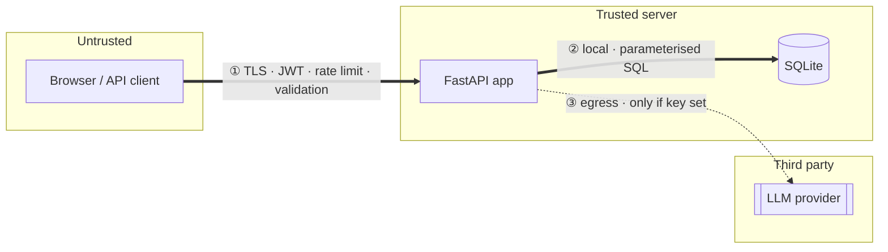
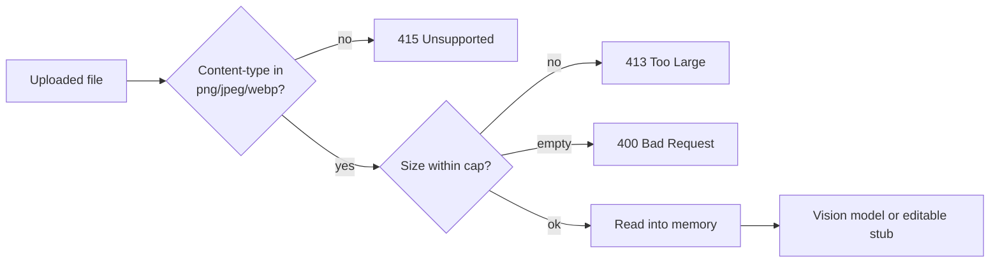

# Security Architecture

How security is **designed into** ThreatGuard. This complements — and does not
duplicate — [SECURITY.md](../../SECURITY.md), which is the *policy* (disclosure,
scope, hardening). This document is for engineers evaluating how the system
defends itself, control by control.

> Companion: [ARCHITECTURE.md](../../ARCHITECTURE.md) covers the general design;
> the audit trail is in [`../audit/`](../audit/).

## Trust boundaries

ThreatGuard is one server process. Three boundaries matter:

| Boundary | Controls |
|----------|----------|
| **① Client ↔ server** | HTTPS (HSTS), CORS (safe default), per-IP rate limiting, JWT authentication, RBAC + ownership authorization, request validation, security headers, generic errors. |
| **② Server ↔ database** | Local SQLite; all access via parameterised queries; dynamic columns whitelisted. No untrusted network in between. |
| **③ Server ↔ LLM provider** | Data-egress boundary crossed **only** when a provider key is configured. Output is treated as untrusted. |

## Data flow (security view)

A request is defended in layers, outermost first:

1. **TLS** terminates at the edge; HSTS is asserted on HTTPS.
2. **CORS** — wildcard origins never carry credentials (credentials only for
   explicitly configured origins).
3. **Rate limiting** — per-IP throttling on auth endpoints (→ `429`).
4. **Security headers** — `X-Frame-Options: DENY`, `X-Content-Type-Options`,
   `Referrer-Policy`, `X-XSS-Protection`.
5. **Authentication** — JWT verified before the handler runs.
6. **Authorization** — permission + per-resource ownership check.
7. **Validation** — Pydantic models; file type/size checks for uploads.
8. **Persistence** — parameterised SQL only.
9. **Rendering** — output escaped (templates autoescape; report escaping).

## LLM boundary

The single point where user data may leave the host.

- **Crossed only if a provider key is set.** With no key, the rule engine runs
  entirely locally and this boundary does not exist.
- **What crosses:** the system description text and, for diagram extraction, the
  uploaded image — sent to the configured provider (Anthropic, or any
  OpenAI-compatible endpoint including local ones like Ollama/vLLM).
- **Data minimization:** only the material needed for the specific enrichment is
  sent; credentials, other users' data, and stored analyses are not.
- **No telemetry.** The application does not phone home.

## Prompt lifecycle

Implemented in `threat_engine/llm.py`, a thin fail-safe layer.

1. **Construct** — an instruction (system role) plus the user's system
   description/image (user role). No secrets are embedded in prompts.
2. **Send** — to the resolved provider; provider chosen by `LLM_PROVIDER` or
   auto-detected from the key.
3. **Receive** — the response is **untrusted input**. It is parsed defensively
   (JSON where structured output is expected) and **escaped on render**; it is
   never executed and never interpolated raw into HTML/SQL.
4. **Fail safe** — any error returns `None`; the deterministic engine continues.
   The request never fails because the model did.

**Prompt-injection stance:** a crafted system description could steer the model's
*suggestions*. Impact is bounded because (a) the rule engine, not the model, is
the authoritative source of threats; (b) model output is advisory and clearly
supplementary; and (c) output is escaped, so injection cannot become XSS or code
execution. Treat AI output as a draft for human review (see
[KNOWN_LIMITATIONS.md](../../KNOWN_LIMITATIONS.md)).

## File upload flow

Only architecture-diagram images are accepted.

- **Allowlist** on content type; **size cap** enforced; empty rejected.
- The file is **read into memory** and handed to the extractor. It is **never
  written to disk with a user-controlled path**, so there is no path-traversal
  surface, and nothing is executed.
- Auth is required — anonymous upload is rejected.

## Report generation

Reports render user- and model-supplied text, so output encoding is the key
control.

- **HTML report:** all interpolated values pass through an escaper; values
  embedded in the in-page `` cannot break out (this was a real stored-XSS bug,
  now fixed — see [`../audit/02-security-audit.md`](../audit/02-security-audit.md)).
- **Server-rendered pages:** Jinja2 autoescape is on.
- **PDF:** generated with ReportLab from structured data, not by rendering
  attacker HTML.
- **CSV risk register:** a known consideration is spreadsheet **formula
  injection** (a cell beginning with `= + - @` can execute in some spreadsheet
  apps). This is tracked as a hardening item; treat exported CSVs as you would
  any untrusted spreadsheet, or open them in a text-first viewer.

## Secrets management

- All secrets come from **environment variables**: `JWT_SECRET`, provider API
  keys, and the initial admin credentials. None are hardcoded.
- `.env` is git-ignored; `.env.example` documents variables with placeholder
  values only.
- **Docker Compose fails fast** if `JWT_SECRET` or the admin credentials are
  unset — the app cannot boot with insecure defaults.
- Secrets are **never logged** (the request logger records only
  `method path → status`), and **never sent to the LLM**.
- Defense in depth: gitleaks in CI, plus (recommended) GitHub native secret
  scanning + push protection.

## Authentication

- **JWT** access tokens with a unique `jti`; **refresh tokens rotate** on use
  (reuse of a rotated token is rejected) and are revoked on logout.
- **bcrypt** password hashing.
- **Account lockout** after repeated failed logins; **per-IP rate limiting** on
  auth endpoints.
- Tokens are carried in the `Authorization: Bearer` header (not cookies), so
  classic CSRF does not apply.

## Authorization

- **RBAC** with three roles (user / management / admin) driven by a permission
  registry.
- **Per-resource ownership**: a user can only act on their own threat models;
  management is read-only across the org; admin is full.
- **Secure by default**: every data endpoint requires a session. An automated
  test calls **every** route anonymously and asserts none serve protected data;
  IDOR paths are explicitly tested.

## Threat assumptions

What the design assumes — state these when evaluating fit.

**Trusted**
- The host and OS the app runs on.
- The operator (who sets `JWT_SECRET`, admin credentials, `CORS_ORIGINS`, TLS).
- The configured LLM provider, to the extent data is sent to it.
- The local SQLite file and filesystem.

**Untrusted**
- All client/API input, all uploaded files, and **all LLM output**.
- The network between client and server (hence TLS/JWT).

**Assumptions & non-goals**
- **Single-tenant per deployment.** RBAC and ownership separate *users*, but the
  system is **not** designed to isolate mutually-distrusting tenants.
- Operators are expected to run HTTPS, set a strong `JWT_SECRET`, and restrict
  `CORS_ORIGINS` in production.
- DoS resistance is basic (rate limiting/lockout), not comprehensive.
- Single-instance/SQLite; rate-limit and lockout state are in-process.

**Explicitly out of scope**
- Host or supply-chain compromise of the running environment.
- The LLM provider's server-side data handling (governed by their policy).
- Side-channel and physical attacks.

See [KNOWN_LIMITATIONS.md](../../KNOWN_LIMITATIONS.md) for the operational limits
and [`../audit/`](../audit/) for the evidence behind these controls.
